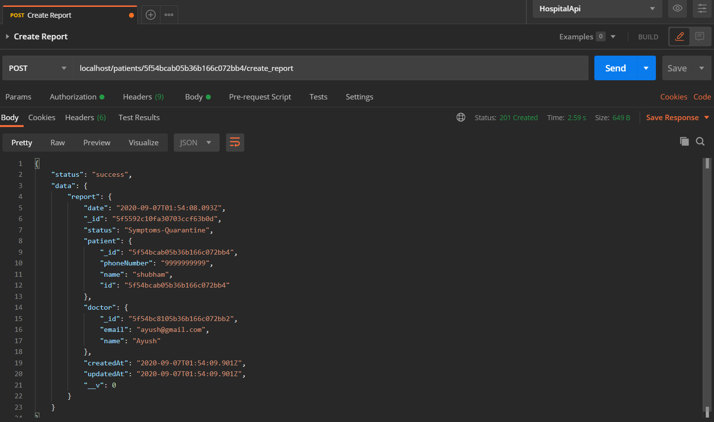

# Hospital API

> It is an API which is used during covid19 situation where Dr. can regiter your self. Through this API,Dr. can register patient and create report about patient.And Dr. can see report by patient id(no need to authenticate) and through the status also(authentication need).

## Table Of Content

- [Features](#Features)
- [Technology Used](#Technology-Used)
- [Folder Structure](#Folder-Structure)
- [Quick Start](#Quick-Start)
- [Demo](#Demo)

## Features

- sign up with email and password
- register patient
- create report
- get report

## Technology Used

| Technology   | Version |
| ------------ | ------- |
| bcryptjs     | 2.4.3   |
| dotenv       | 8.2.0   |
| express      | 4.17.1  |
| jsonwebtoken | 8.5.1   |
| mongoose     | 5.10.3  |
| nodemon      | 2.0.4   |
| passport     | 0.4.1   |
| passport-jwt | 4.0.0   |
| validator    | 13.1.1  |

## Folder structure

```
hospital_api
├─ assets
│  └─ img
│     ├─ Register.png
│     ├─ createReport.png
│     ├─ getReports.png
│     ├─ login.png
│     ├─ patientRegister.png
│     └─ reports.png
├─ config
│  ├─ AppError.js
│  ├─ catchAsync.js
│  ├─ mongoose.js
│  └─ passport-jwt-strategy.js
├─ controllers
│  ├─ authController.js
│  ├─ errorController.js
│  ├─ patientController.js
│  └─ reportController.js
├─ models
│  ├─ patient.js
│  ├─ report.js
│  └─ user.js
├─ routes
│  ├─ doctors.js
│  ├─ index.js
│  ├─ patients.js
│  └─ reports.js
├─ .gitignore
├─ app.js
├─ config.env
├─ package-lock.json
├─ package.json
├─ readme.md
└─ server.js
```

## [Back To Top](#Hospital-API)

## Quick Start

**Clone the repository with the below command:**

```bash
   git clone https://github.com/ayushkumar731/hospital_api.git
```

**Into the project directory**

```
    cd hospital_api
```

**Install npn dependencies**

```bash
    npm install
```

**Set your all id's password ,secret key etc. in config.env file'**

```bash
    DATABASE_URL=Your Atlas MongoDB link or you can use local database
    DATABASE_PASSWORD=If You are using Atlas then provide your database password

    JWT_SECRET_KEY=Provide random 32bit string
    JWT_EXPIRES_IN=set the day as you want(eg. 30d)
```

**Start project by using command below**

```bash
    npm start
```

**The Server now be running at** http://localhost:80/

**To run in the Postman with the following routes :-**

- POST -> **_/doctors/register_** (to register the doctor)

- POST -> **_/doctors/login_** (to Authenticate)

- POST -> **_/patients/register_** (to register the patient with mobile number "If patient all ready register then you get the reports of patient", 'Authentication need')

- POST -> **_/patients/:id/create_report_** (to create a report with status either :'Negative','Travelled-Quarantine','Symptoms-Quarantine','Positive-Admit'. imp!-"Dr. should be authenticate" )

- GET -> **_/patients/:id/all_reports_** (to check the report of pateint old to new ,'no need to Authenticate,patient can also check your status with their relative ID')

- GET -> **_/reports/:status_** (To check the patient list with the status .Set status as a 'params'..'Aunthentication need')

## [Back To Top](#Hospital-API)

## Demo

### To register the Doctor


### To Authenticate


### To Register the patient


### Create Report for patient



### Get Reports by Patient ID


### Get Reports by Status


## [Back To Top](#Hospital-API)
